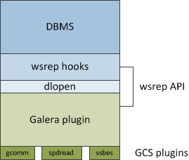

===================
 Replication API
===================
.. _`Replication API`:

As we learned in the introduction, synchronous replication
uses eager replication, where the nodes keep all other nodes
synchronized by updating all replicas in a single transaction.
In other words, when a transaction commits, all nodes have the
same value. This takes place by using writeset replication
over group communication.

The *Galera Cluster* replication architecture software entities are 

- *DBMS* |---| A Database Management System (DBMS), such as MySQL.
- *wsrep API* |---| The wsrep API defines the interface and the
  responsibilities for the DBMS and replication provider. The
  wsrep API consists of:

  - *wsrep hooks* |---| The wsrep integration in the DBMS engine.
  - *dlopen* |---| The ``dlopen()`` function makes the wsrep
    provider available to *wsrep hooks*. 

- *Galera Replication Plugin* |---| The :term:`Galera Replication Plugin`
  provides the *wsrep* service functionality.
- *Group communication plugins* |---| Galera can use various
  group communication systems. We have used, for example,
  *gcomm* and Spread (http://www.spread.org/).

The entities above are depicted in the figure below and explained
in more detail in the chapters below:

   *Replication API*

---------------
 wsrep API
---------------
.. _`wsrep API`:

.. index::
   pair: Global Transaction ID; Descriptions
.. index::
   pair: wsrep API; Descriptions

The *wsrep API* is a generic replication plugin interface for databases.
The API defines a set of application callbacks and replication
plugin calls. 

The *wsrep API* is used in a replication model where an application, such
as a database server, has a state. In practice, the state refers to the
contents of the database. When the database is used, clients modify the
database contents and the database state changes. This changing of the
state is represented as a series of atomic changes (transactions). In
a database cluster, all nodes always have the same state, which they
synchronize with each other by replicating and applying state changes
in the same serial order.

From a more technical perspective, the state change process is
as follows:

1. A state change takes place on the database.
2. The *wsrep hooks* within the database populate the write sets
   for the other database nodes in the cluster.
3. The *wsrep provider* functions are made available for
   the *wsrep hooks* through the ``dlopen()`` function.
4. The Galera Replication Plugin handles the writeset certification and
   replication to the other database nodes in the cluster.

At the receiving end, the application process takes place by high
priority transaction(s).

To keep the state identical on all nodes, the *wsrep API* uses a Global
Transaction ID (GTID), which is used to both:

- Identify the state change
- Identify the state itself by the ID of the last state change

The GTID consists of:

- A state UUID, which uniquely identifies the state and the
  sequence of changes it undergoes
- An ordinal sequence number (seqno, a 64-bit signed integer)
  to denote the position of the change in the sequence
  
By using the GTID, you can

- Compare the application states
- Establish the order of state changes
- Determine whether the change was applied or not
- Whether the change is applicable at all to a given state (in
  short, whether it is all-powerful)

In a human-readable format, the GTID might look like this::

    45eec521-2f34-11e0-0800-2a36050b826b:94530586304

---------------------------
 Galera Replication Plugin
---------------------------
.. _`Galera Replication Plugin`:

Galera Replication Plugin implements the *wsrep API* and operates
as the *wsrep provider*.  From a more technical perspective,
it consists of:

- *Certification layer* |---| The certification layer prepares
  the write sets and performs the certification.
- *Replication layer* |---| The replication layer manages the
  replication protocol and provides the total ordering
  capability.
- *Group communication framework* |---| The group communication
  framework provides a plugin architecture for various group
  communication systems.

------------------------------
 Group Communication Plugins
------------------------------

.. index::
   pair: Virtual Synchrony; Descriptions

The group communication framework provides a plugin
architecture for various group communication systems.

*Galera Cluster* is built on top of a proprietary
group communication system layer which implements
virtual synchrony :abbr:`QoS (Quality of Service)`. Virtual
synchrony unifies the data delivery and cluster membership
service, which provides clear formalism for message
delivery semantics. 

Virtual Synchrony guarantees consistency, but not temporal
synchrony, which is required for smooth multi-master
operation. For this purpose, Galera implements its own
runtime-configurable temporal flow control, which keeps
nodes synchronized to a fraction of second.

The group communication framework also provides total
ordering of messages from multiple sources, which is
used to build Global Transaction IDs in a multi-master
cluster. 

At the transport level, *Galera Cluster*
is a symmetric undirected graph, where all database nodes are
connected with each other over a :abbr:`TCP (Transmission
Control Protocol)` connection. By default, TCP
is used for both message replication and the cluster
membership service, but also :abbr:`UDP (User Datagram Protocol)`
multicast can be used for replication in a :abbr:`LAN (Local Area Network)`.

.. |---|   unicode:: U+2014 .. EM DASH
   :trim:
