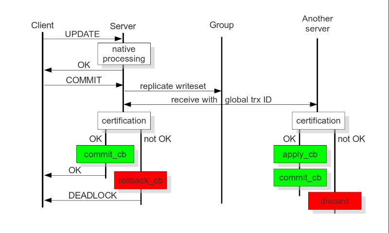

===================================
 Certification Based Replication
===================================
.. _`Certification Based Replication`:
.. index::
   pair: Certification Based Replication; Descriptions

Certification based replication uses group communication and
transaction ordering techniques to achieve synchronous replication.
Transactions execute optimistically in a single node (or replica)
and, at commit time, run a coordinated certification process to
enforce global consistency. Global coordination is achieved with
the help of a broadcast service that establishes a global total
order among concurrent transactions.  

Pre-requisites for certification based replication:

- The database is transactional (that is, it can rollback
  uncommitted changes).
- Each replication event changes the database atomically
  (that is, the series of database operations either all
  occur, or nothing occurs).
- Replicated events are globally ordered (that is, applied
  on all instances in the same order).

Certification based replication is described in the software
sequence diagram below:

   *Certification Based Replication*

The main idea is that a transaction is executed conventionally
until the commit point, under the assumption that there will be
no conflict. This is called optimistic execution. When the client
issues a ``COMMIT`` command (but before the actual commit has happened),
all changes made to the database by the transaction and the
primary keys of changed rows are collected into a writeset.
This writeset is then replicated to the rest of the nodes.
After that, the writeset undergoes a deterministic certification
test (using the collected primary keys) on each node (including
the writeset originator node) which determines if the writeset
can be applied or not.  

If the certification test fails, the writeset is dropped and
the original transaction is rolled back. If the test succeeds,
the transaction is committed and the writeset is applied on
the rest of the nodes.  

The certification test implemented in *Galera Cluster* depends on the
global ordering of transactions. Each transaction is assigned
a global ordinal sequence number during replication. Thus, when
a transaction reaches the commit point, the sequence number of
the last transaction it did not conflict with, is known.
The interval between those two numbers is an uncertainty land:
transactions in this interval have not seen the effects of
each other. Therefore, all transactions in this interval are
checked for primary key conflicts with the transaction in
question. The certification test fails if a conflict is
detected.

Since the procedure is deterministic and all replicas receive
transactions in the same order, all nodes reach the same decision
about the outcome of the transaction. The node that started the
transaction can then notify the client application if the
transaction has been committed or not.

.. |---|   unicode:: U+2014 .. EM DASH
   :trim:
