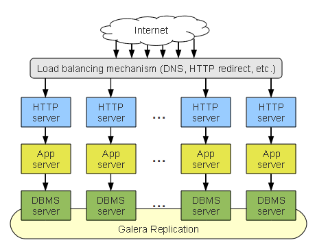

===========================
 Galera Replication Plugin
===========================
.. _`Galera Replication Plugin`:

The :term:`Galera Replication Plugin` is a synchronous multi-master replication
plug-in for MySQL, MariaDB and Percona XtraDB cluster. Galera
Replication Plugin features are, for example:

- Unconstrained parallel applying, also known as parallel
  replication
- Multicast replication
- Automatic node provisioning

The primary focus of the Galera Replication Plugin is data consistency:
the transactions are either applied on every node, or not at
all. In short, the Galera Replication Plugin keeps databases synchronized
provided that they were properly configured and synchronized
at the beginning.

The Galera Replication Plugin differs from the regular MySQL Replication
by, for example, addressing a number of issues including write
conflicts when writing on multiple masters, replication lag
and slaves being out of sync with the master.

See below for an example of a typical Galera Replication
cluster:

   *Galera Replication Cluster*

Applications can write to any node in a Galera Replication
cluster, and transaction commits (RBR events) are then
applied on all servers, through certification-based replication.

Certification-based replication is an alternative approach to
synchronous database replication using group communication
and transaction ordering techniques.

The minimal recommended Galera Replication cluster consists of three nodes.