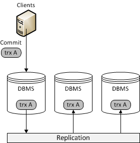

======================
 Database Replication
======================
.. _`Database Replication`:

.. index::
   pair: Database cluster; Descriptions

Database replication refers to the frequent copying of data
from one node, that is, a database on one server, to a node on
another server. A database replication system is, in other words,
a distributed database in which all nodes share the same level
of information. This system is also known as a database cluster.

The database client (such as a Web browser or a computer
application) does not see the database replication system in any
way, but experiences close to native :abbr:`DBMS (DataBase Management System)`
behavior.

---------------------
 Masters and Slaves
---------------------
.. _`Masters and Slaves`:

Many database management systems replicate databases. The most
common replication method is to create a master/slaves relationship
between the original data set (master) and its copies (slaves).
The master logs the updates to the data, and propagates the logs
through a network to the slaves. The slaves, for their part, receive
a stream of updates from the master and apply the changes accordingly.

A master/slaves relationship is depicted in the figure below:

   *Master/Slave Replication*

Another common replication method is to create a multi-master replication
system, where updates can be submitted to any database node, and
then propagated through a network to other database nodes. In other
words, all database nodes act as masters, and no logs or update
success indications are sent. 

A multi-master replication system is depicted in the figure below:

.. figure:: images/synchronousreplication.png

   *Multi-master Replication*

----------------------------------------------
 Asynchronous and Synchronous Replication
----------------------------------------------
.. _`Asynchronous and Synchronous Replication`:

.. index::
   pair: Eager replication; Descriptions
.. index::
   pair: Lazy replication; Descriptions
.. index::
   pair: Asynchronous replication; Descriptions
.. index::
   pair: Synchronous replication; Descriptions

From a more technical perspective, asynchronous and synchronous
replication protocols differ in the way they propagate database
transactions to other nodes in the database cluster:

- Synchronous replication uses an approach known as eager
  replication. In eager replication, the nodes keep all
  replicas synchronized by updating all replicas in a
  single transaction. In other words, when a transaction
  commits, all nodes have the same value.

- Asynchronous replication uses an approach known as lazy
  replication. In lazy replication, the master database
  asynchronously propagates replica updates to other
  nodes after the replicating transaction commits.
  In other words, when a transaction commits, nodes can
  have different values at least for a short while.

Theoretically, synchronous replication has several advantages
over asynchronous replication:

- Synchronous replication provides highly available clusters
  and guarantees 24/7 service availability, as:

  - There is no data loss when one of the nodes crashes
  - Data replicas are always consistent
  - There are no complex, time-consuming failovers
  
- Transactions can be executed on all nodes in parallel
  to increase performance.

- Synchronous replication can guarantee causality across
  the whole cluster. For example, a ``SELECT S`` issued after
  transaction ``T`` will always see the effects of the
  transaction even if it were executed on another node.

Traditionally, eager replication protocols coordinated nodes
one operation at a time, using *2-phase commit* or distributed
locking. In a system with *x* nodes and *y* operations, a
throughput of *z* transactions per second requires
*x* |times| *y* |times| *z* messages per second. When
the number of nodes increases, transaction response times,
conflict probability and deadlock rates grow exponentially.
This has led to a situation where asynchronous replication
remains the dominant means for database performance scalability
and availability. Widely adopted open-source databases such as
MySQL or PostgreSQL only offer asynchronous replication
solutions.

-----------------------------------------------
 Solving the Issues in Synchronous Replication
-----------------------------------------------
.. _`Solving the Issues in Synchronous Replication`:

To solve the problems in the traditional synchronous replication
systems and approaches, researchers all around the world have,
in the last couple of years, suggested alternative approaches
to synchronous database replication. In addition to theory,
prototype implementations have shown a lot of promise. The most
important improvements these studies have brought about are:

- **Group communication** |---| Group communication is a high
  level abstraction that defines patterns for the communication
  of database nodes to guarantee the consistency of replicated data.
- **Write sets** |---| Write sets bundle database writes into a single
  *writeset* message, thus avoiding the coordination of nodes
  one operation at a time.
- **Database State Machine** |---| In the Database State
  Machine, read-only transactions are processed locally on a
  database site, and update transactions are first executed
  locally on a database site (on shadow copies), and then
  broadcast as a read set to the other database sites for
  certification and possibly commit.
- **Transaction Re-ordering** |---| Transaction re-ordering
  means that transactions are re-ordered before they are
  committed and broadcast to the other database sites.
  Reordering increases the number of transactions that
  successfully pass the certification test.

*Galera Cluster*'s certification based replication builds on these approaches.

.. |times|   unicode:: U+00D7 .. MULTIPLICATION SIGN

.. |---|   unicode:: U+2014 .. EM DASH
   :trim:
