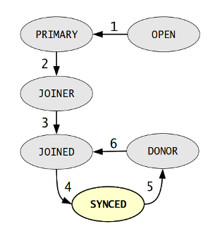

=============
 Flow Control
=============
.. _`Flow Control`:

Flow control allows a cluster node to instruct the other nodes
in the cluster when it needs to pause replication and when it is
ready to continue replication. This prevents any node in the
cluster from lagging too far behind the others in applying
replication.

Read also this Percona article:
http://www.mysqlperformanceblog.com/2013/05/02/galera-flow-control-in-percona-xtradb-cluster-for-mysql/

This chapter describes the flow control of node states and the
possible node state changes. 

---------------
 Node States
---------------
.. _`Node States`:

.. index::
   pair: Node states; OPEN
.. index::
   pair: Node states; PRIMARY
.. index::
   pair: Node states; JOINER
.. index::
   pair: Node states; DONOR
.. index::
   pair: Node states; JOINED
.. index::
   pair: Node states; SYNCED

To ensure temporal synchrony and consistency (as opposed
to logical which is provided by virtual synchrony), *Galera Cluster*
implements several forms of flow control, depending on the
node state. The node states are described in the chapters
below.

``OPEN`` and ``PRIMARY``
=========================

In either of these states, the node is not considered to be
a part of the cluster. It is not allowed to replicate, apply
or cache any write sets. No flow control.

``JOINER`` and ``DONOR``
=========================

In general, the node cannot apply any writesets and it must
cache them. There is no reasonable way to keep the node
synchronized with the cluster (except for stopping all
replication). However, it is possible to limit the replication
rate to make sure that the writeset cache does not exceed the
configured size. The writeset cache size is controlled
by the following variables:

- ``gcs.recv_q_hard_limit`` sets the maximum writeset cache
  size (in bytes). The parameter value depends on the amount
  of RAM, swap size, and performance considerations. The default
  value is ``SSIZE_MAX - 2Gb`` on 32-bit systems. On 64-bit
  systems there is practically no limit for the maximum writeset
  cache size. If this limit is exceeded and ``gcs.max_throttle``
  is not 0.0, the node will abort with an out-of-memory error.
  If ``gcs.max_throttle`` is 0.0, replication in the cluster
  will be stopped.
- ``gcs.max_throttle`` is the smallest fraction of the normal
  replication rate that we can tolerate in the cluster. 1.0 means
  that no replication rate throttling is allowed. 0.0 means that
  a complete replication stop is possible. The default value is
  0.25.
- ``gcs.recv_q_soft_limit`` is a fraction of the ``gcs.recv_q_hard_limit``
  and serves to estimate the average replication rate. When it
  is exceeded, the average replication rate (in bytes) during
  this period is calculated. After that, the replication rate
  is decreased linearly with the cache size in a way that at
  ``gcs.recv_q_hard_limit`` it reaches ``gcs.max_throttle`` |times|
  ``(average replication rate)``. The default value is 0.25.
  
  .. note::  The *average replication rate* estimated here can
             be way off from the sustained one.

To sum up, the writeset cache grows semi-logarithmically with time
after the ``gcs.recv_q_soft_limit`` and the time needed for the
state transfer to complete.

``JOINED``
==========

A ``JOINED`` node can apply writesets. In this state, flow control
makes sure that the node can eventually catch-up with the cluster,
specifically that its writeset cache never grows. Thus, the
cluster-wide replication rate is limited by the rate at which
the node can apply the writesets. Since applying a writeset is
usually several times faster than processing a transaction,
it hardly ever affects the performance of the cluster, except
at the very beginning, when the buffer pool on the node is empty.
Using *parallel applying* can significantly speed it up.

``SYNCED``
==========

In the ``SYNCED`` state, the node flow control attempts to keep
the slave queue to a minimum. This is controlled by the following
configuration variables:

- ``gcs.fc_limit`` |---| When the slave queue exceeds this limit,
  replication is paused. It is essential for multi-master
  configurations that this limit is low, as the certification
  conflict rate is proportional to the slave queue length.
  
  In master-slave setups, this value can be considerably higher
  to reduce flow control intervention. The default value is 16.
- ``gcs.fc_factor`` |---| When the slave queue goes below
  ``gcs.fc_limit`` |times| ``gcs.fc_factor``, replication
  is resumed. The default value is 0.5.

.. note:: While it is critical for multi-master operation to have
          as small slave queue as possible, the slave queue length
          is not so critical for master-slave setups, since,
          depending on the application and hardware, even 1K of
          writesets may be applied in a fraction of a second.
          The slave queue length has no effect on master-slave
          failover.
  
.. warning:: Since Galera nodes process transactions asynchronously
             with regards to each other, the amount of replication
             data cannot be anticipated in any way. Hence,
             the *Galera Cluster*
             flow control is reactive, that is, it only affects after
             certain limits are exceeded. It cannot prevent exceeding
             these limits or make any guarantees about by how much
             these limits will be exceeded. For example, if
             ``gcs.recv_q_hard_limit`` is set to ``100Mb``, it can
             still be exceeded by a 1Gb writeset.

--------------------
 Node State Changes
--------------------
.. _`Node State Changes`:
.. index::
   pair: Node states; Node state changes

The *Galera Cluster* node state
machines handle different state changes on different
*Galera Cluster* layers. At the
top layer, there are node state changes as depicted in
the figure below:

   *Galera Cluster Node State Changes*

In the figure:

1. The node establishes a connection to a :term:`Primary Component`.
2. The state *transfer request* of the node succeeds. The node
   starts to cache the write sets.
3. The node receives a state snapshot. Now it has all cluster
   data and can start applying the cached writesets. Flow control
   is switched on to ensure eventual slave queue decrease.
4. The node completes catching up with the cluster (the slave
   queue is empty). Flow control is switched on to keep the
   slave queue empty. The MySQL ``wsrep_ready status`` variable
   is set to 1 and the node is allowed to process transactions.
5. The node receives a state transfer request. Flow control is
   relaxed to ``JOINER``. The node caches the write sets it
   cannot apply.
6. The node completes the state transfer to ``JOINER``.

.. note:: To keep the graph easier to read, the following
          transitions were omitted from it:

          - At any time, cluster configuration change event
            can send the node to ``PRIMARY`` or ``OPEN``
            state, for example ``SYNCED`` |-->| ``OPEN``,
            when a node loses connection to primary component
            due to network partition.  
          - If the node does not need a state transfer (for
            example, a node restart in an idle cluster) it
            goes straight from the ``PRIMARY`` state to the
            ``JOINED`` state.

.. |---|   unicode:: U+2014 .. EM DASH
   :trim:

.. |-->|   unicode:: U+2192 .. RIGHTWARDS ARROW
   :trim:
   
.. |times|   unicode:: U+00D7 .. MULTIPLICATION SIGN
