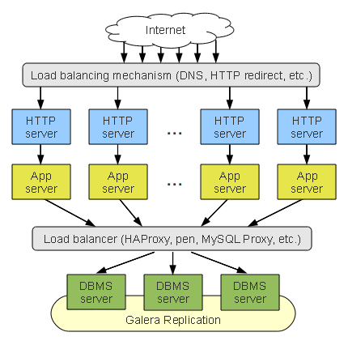
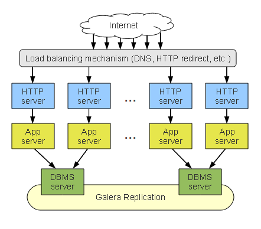

==============================
 Cluster Deployment Variants
==============================
.. _`Cluster Deployment Variants`:

*Galera Cluster for MySQL* consists of nodes. We recommend that you
have at least three nodes in your cluster. Each cluster
node is a regular MySQL server and you convert your
existing MySQL server into a node and use that server
as the cluster base. 

Due to its synchronous multi-master qualities, the
*Galera Cluster* can be
seen as a single server listening at many interfaces. To give
you an idea of what *Galera Cluster*
is capable of, we will consider a typical N-tier application
and discuss different benefits and considerations of deploying
*Galera Cluster* in that context.

-------------------
 No Clustering
-------------------

The figure below depicts an N-tier application cluster without
clustering. Since the upper tiers are usually stateless, you can
start up as many instances as necessary without any concern for
synchronization; the instances store their data in the data tier.

This is a simple and easy-to-manage solution. However, the
:abbr:`DBMS (Database Management System)` server at the data tier
is a :abbr:`SPoF (Single Point Of Failure)` and a performance
bottleneck.

.. figure:: images/galerausecases0.png

   *No Clustering*

--------------------
 Whole Stack Cluster
--------------------

The figure below depicts an N-tier application cluster using
whole stack clustering, where each stack has a dedicated
database server.

.. figure:: images/galerausecases1.png

   *Whole Stack Cluster*

This is a simple and easy-to-manage solution, especially if you
can install the whole stack in one physical machine. Due to the
direct connection from the application tier to the
:abbr:`DBMS (Database Management System)`, the solution has
low latencies.

Whole stack clustering has the following challenges:

- :abbr:`DBMS (Database Management System)` failure fails
  the whole stack.
- Inefficient resource usage:

  - Having a dedicated database server for each application
    stack is overuse.
  - Poor resource consolidation. One server with a 7Gb buffer
    pool is much faster than two servers with 4Gb buffer pools.

- Increased unproductive overhead: each server duplicates the work of others.
- Increased rollback rate due to cluster-wide conflicts.
- Inflexibility. There is no way to limit the number of master nodes,
  or perform intelligent load-balancing.
  
Despite a long list of considerations, this setup can be usable
for several applications. 

-------------------
 DBMS-tier Cluster
-------------------

To address the shortcomings of the whole stack cluster scheme,
we can cluster the data tier separately and present it to the
application as a single virtual server. The figure below depicts
this solution.

   *DBMS-tier Cluster*

In this solution, the failure of one node does not affect the
rest of the cluster. Furthermore, resources are consolidated
better and the setup is flexible: nodes can be assigned different
roles by using intelligent load balancing.

DBMS-tier clustering has the following challenges:

- The structure is complex. A load balancer is involved and it
  must be backed up in case of failures. This typically means
  that you must have two more servers and a failover solutions
  between them.
- Management is more complex. The load balancer must be
  configured and reconfigured, when a :abbr:`DBMS (Database Management System)`
  node is added to or removed from the cluster.
- Connections to the :abbr:`DBMS (Database Management System)` 
  servers are not direct. If you place a proxy between the application
  and the server, you end up with increased latencies for each query.
  This can easily become a performance bottleneck (load-balancing
  servers should be very powerful).
- An attempt to spread this setup over several datacenters may
  cancel resource consolidation benefits, as each datacenter will
  have to have at least two :abbr:`DBMS (Database Management System)` servers.
  
DBMS-tier Cluster with Distributed Load Balancing
=================================================

We can improve the DBMS-tier cluster by placing a dedicated load
balancer on each application server. The figure below depicts
this solution.

.. figure:: images/galerausecases3.png

   *DBMS-tier Cluster with Distributed Load Balancing*

In DBMS-tier cluster with distributed load balancing the load
balancer is no longer a single point of failure. Furthermore,
the load balancer scales with the application cluster and is
unlikely to become a bottlenecks. Finally, the client-server
communication latencies are lower.

DBMS-tier clustering with distributed load balancing has
the following challenges:

- There are N load balancers to manage and reconfigure when
  the database cluster configuration changes.

Aggregated Stack Cluster
========================

We can also create a hybrid setup where we can aggregate several
application stacks to use a single :abbr:`DBMS (Database Management System)`
server. The figure below depicts
this solution.

   *DBMS-tier Cluster with Distributed Load Balancing*

This solution improves the resource utilization of the whole
stack cluster and still maintains its relative simplicity and
direct DBMS connections benefits. This is how a DBMS-tier cluster
with distributed load balancing would look like, if we only use
one :abbr:`DBMS (Database Management System)` node per datacenter.
This can be a good setup for sites, which are not very big, but
still are hosted at more than one datacenter.
