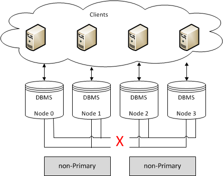

===================
 Primary Component
===================
.. _`Primary Component`:

In addition to single node failures, the cluster may be split into
several components due to network failure. A component is a set of
nodes, which are connected to each other, but not to nodes in other
components. 

In such a situation, only one of the components can continue to
modify the database state to avoid history divergence. This component
is called the Primary Component (PC). In normal operation, the
*Galera Cluster* is a PC. When
cluster partitioning happens, *Galera Cluster*
invokes a special quorum algorithm to select a PC that guarantees
that there is no more than one primary component in the cluster.

.. seealso:: Chapter :ref:`Galera Arbitrator <Galera Arbitrator>`

-------------------
 Weighted Quorum
-------------------
.. _`Weighted Quorum`:
.. index::
   pair: Weighted Quorum; Descriptions
.. index::
   pair: Parameters; wsrep_provider_options
.. index::
   single: Split-brain; Descriptions

The current number of nodes in the cluster defines the current
cluster size. There is no configuration setting that would define
the list of all possible cluster nodes. As a result, every time
a node joins the cluster, the total size of the cluster is increased
and when a node leaves the cluster (gracefully) the size is
decreased.

The cluster size determines the required votes to achieve quorum.
A quorum vote is carried out when a node does not respond
and is suspected to no longer be part of the cluster. This no
response timeout is defined by the ``evs.suspect_timeout`` setting
in the ``wsrep_provider_options`` (default 5 sec).

If a node is determined to be disconnected, the remaining nodes
cast a quorum vote. If a majority from the total nodes connected
from before the disconnect remains, that partition remains up.
In the case of a network partition, there will be nodes active
on both sides of the network disconnect. In this case, only
the quorum will continue, the partition(s) without quorum will
enter the non-Primary state and attempt to connect to the
Primary Component.

.. figure:: images/pc.png

As quorum requires a majority, you cannot have automatic failover
in a two node cluster. The failure of one node will cause the
remaining node to go non-Primary. Furthermore, a cluster with an
even number of nodes has a risk of a potential split brain condition; if
network connectivity is lost somwhere between partitions, and the
number of nodes is split exactly in half, neither partition would
retain quorum, and both would go to non-Primary, as depicted in the
figure below.

For automatic failover, use at least three nodes. The same applies
on other infrastructure levels. For example:

- A cluster on a single switch should have 3 nodes
- A cluster spanning switches should be spread across at least 3 switches
- A cluster spanning networks should be spread across at least 3 networks
- A cluster spanning data centers should spread across at least 3 data centers

To prevent the risk of a split-brain situation within a
cluster that has an even number of nodes, partition the
cluster in a way that one component always forms the
Primary cluster section. For example (P = Primary, NP = Non-Primary):

4 -> 3(P) + 1(NP)
6 -> 4(P) + 2(NP)
6 -> 5(P) + 1(NP)

In these partitioning examples, it is extremely rare that the
number of nodes would be split exactly in half.

-------------------
Quorum Calculation
-------------------

.. index::
   pair: Parameters; pc.weight

Galera Cluster supports a weighted quorum, where
each node can be assigned a weight in the 0 to 255 range, with which it
will participate in quorum calculations. 

The quorum calculation formula is::

    (sum(p_i x w_i) - sum(l_i x w_i))/2 < sum(m_i x w_i)
    
Where:

- *p_i* |---| Members of the last seen primary component
- *l_i* |---| Members that are known to have left gracefully
- *m_i* |---| Current component members
- *w_i* |---| Member weights

In other words, the quorum is preserved if (and only if) the sum
weight of the nodes in a new component strictly exceeds half of
that of the preceding :term:`Primary Component`, minus the nodes which left
gracefully.

Node weight can be customized by using the ``pc.weight`` Galera
parameter. By default, the node weight is 1, which translates into
the traditional "node count" behavior.

.. note:: The node weight can be changed in runtime simply by setting
          the ``pc.weight`` parameter. The new weight is applied when
          a message carrying a weight is delivered. At the moment,
          there is no mechanism to notify on application of the new
          weight, but it will just "eventually" happen, when the
          message is delivered.

.. warning:: If a group partitions at the moment when the weight change
             message is delivered, all partitioned components that deliver
             weight change messages in the transitional view will become
             non-primary components. Partitions that deliver messages
             in the regular view will go through the quorum computation
             with the applied weight when the following transitional view
             is delivered. In other words, there is a corner case where
             the entire cluster can end up in a non-primary component, if
             the weight changing message is sent at the moment when the
             partitioning takes place.
             
             Recovery from such a situation should be done by either
             waiting for a re-merge or by inspecting which partition
             is most advanced and by bootstrapping it as a new primary
             component.

---------------------------------
 Weighted Quorum Examples
---------------------------------
.. _`Weighted Quorum Examples`:

See below for some weighted quorum examples and use cases:

- Weighted quorum for three nodes::

    n1: weight 2
    n2: weight 1
    n3: weight 0
  
  Killing nodes n2 and n3 simultaneously preserves primary component
  on n1. Killing n1 makes n2 and n3 become non-primary components.
- Weighted quorum for a simple master-slave scenario::

    n1: weight 1
    n2: weight 0
  
  If master n1 dies, n2 will end up become a non-primary component.
  However, if n2 dies, n1 will continue as the primary component.
  If the network connection between n1 and n2 fails, n1 will continue
  as the primary component and n2 will become a non-primary component.
- Weighted quorum for a master and multiple slaves scenario::

    n1: weight 1
    n2: weight 0
    n3: weight 0
    ...
    nn: weight 0

  If n1 dies, all remaining nodes end up as non-primary components.
  If any other node dies, the primary component is preserved. In the
  case of network partitioning, n1 will always remain as a primary
  component.
- Weighted quorum for a primary and secondary site scenario::

    n1: weight 2
    n2: weight 2
    n3: weight 1
    n4: weight 1

  Site 1 has nodes n1 and n2, site 2 has nodes n3 and n4. Setting node
  weights as above guarantees that nodes at site 1 remain the primary
  component if site 2 goes down or if the network between the sites
  fails. Also, either n1 or n2 can crash without the rest of the nodes
  becoming non-primary components.
  
  
.. |---|   unicode:: U+2014 .. EM DASH
   :trim: